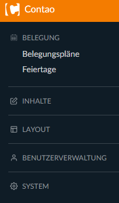
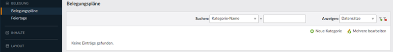
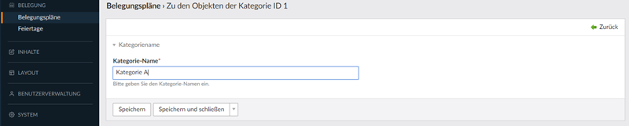
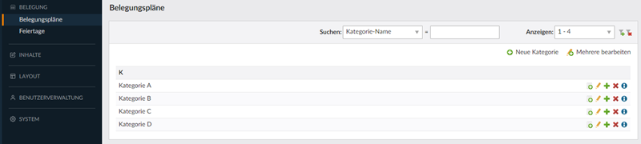
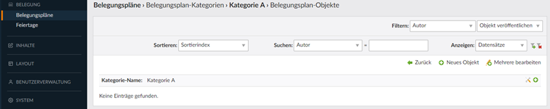
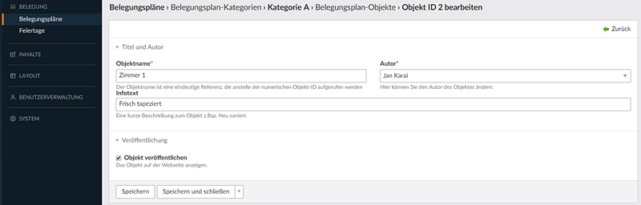
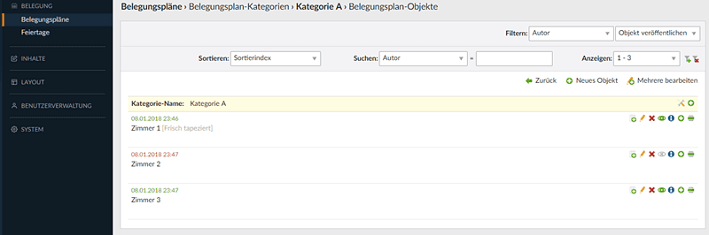

# Contao 4 Belegungsplan Bundle

1. [**Installation**](installation.md)
2. **Backend**

## Backend

Nach der Installation und der aktualisierung der Datenbank im Installtool finden Sie im Menü links einen weiteren Eintrag.

Dieses Belegungsplan-Bundle funktioniert nach folgendem Prinzip:
1. Kategorien
2. Objekte
3. Belegungszeiten

Nach Klick auf "Belegungspläne" und einer frischen Installation, sehen Sie folgendes Fenster.

Legen sie zuerst eine oder mehrere Kategorien an.

Mit Klick auf das grüne Plus hinter jeder Kategorie, gelangen Sie zur Eingabe der Objekte (Zimmer, Häuser etc.)

Mit Klick auf "Neues Objekt" gelangen Sie zur Eingabemaske für die Objekte.
In dem Textfeld "Infotext" kann eine kurze Beschreibung eingegeben werden, welche dann im Frontend hinter dem jeweiligen Objekt erscheint.

Erstellte Objekte können ausgeblendet und in der Reihenfolge verschoben werden.

