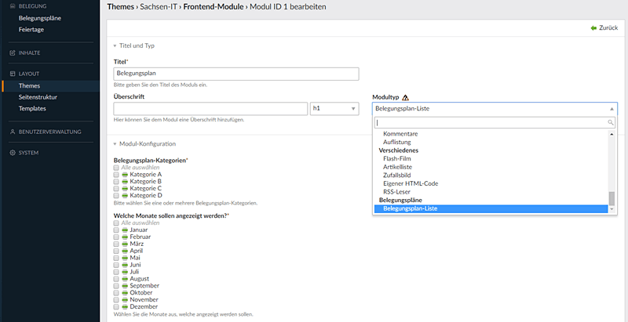

# Contao 4 Belegungsplan Bundle

1. [**Installation**](installation.md)
2. [**Backend**](backend.md)
3. **Einbindung Frontend**

## Einbindung Frontend

Erstellen Sie in ihrer Contao-Installation ein neues Modul vom Modultyp "Belegungsplan-Liste"

Hier können Sie nun auswählen welche Kategorien angezeigt werden sollen. Leere Kategorien werden generell nicht angezeigt, gleich welche Einstellung Sie hier vornehmen.
Ebenso können Sie hier die Reihenfolge der Kategorien festlegen durch anfassen und verschieben. So wie Sie die Reihenfolge hier festlegen werden die Kategorien auch im Frontend angezeigt.

Die Auswahl der anzuzeigenden Monate ist dann von Vorteil, wenn Sie z.Bsp. nur saisonale Angebote zur Verfügung stellen. Haben Sie ein ganzjähriges Angebot, dann wählen Sie alle Monate aus.

Speichern Sie ihre Einstellungen und wechseln sie in die Artikelansicht in welches das eben erstellte Modul eingebunden werden soll.

Fügen Sie ein "Neues Inhaltselement" vom Typ "Modul" ein und wählen Sie in "Include-Einstellungen" das eben erstellte Modul ein.

Speichern Sie ihre Einstellungen.
