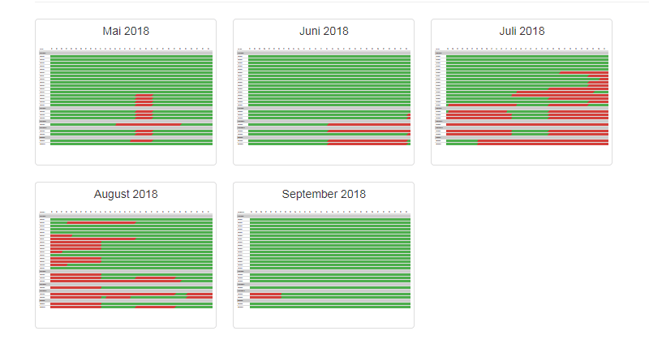

# Contao 4 Belegungsplan Bundle

1. [**Installation**](installation.md)
2. [**Backend**](backend.md)
3. [**Einbindung Frontend**](einbindung-frontend.md)
4. **Frontend**

## Frontend

Wenn alles korrekt funktioniert, erhalten Sie im Frontend die Ausgabe ihrer Daten in Tabellenform.

Sie können nun das Template "mod_belegungsplan" nach ihren Wünschen konfigurieren

## Frontend mit Bootstrap

Eine [**Online-Demo**](http://www.waldeck-ruegen.de/belegungsplan.html) unter Verwendung von Bootstrap-Framework finden Sie [**hier**](http://www.waldeck-ruegen.de/belegungsplan.html).

Das [**Bootstrap-Template**](https://github.com/Mailwurm/mod_belegungsplan_bootstrap) inclusive CSS finden Sie [**hier**](https://github.com/Mailwurm/mod_belegungsplan_bootstrap).
